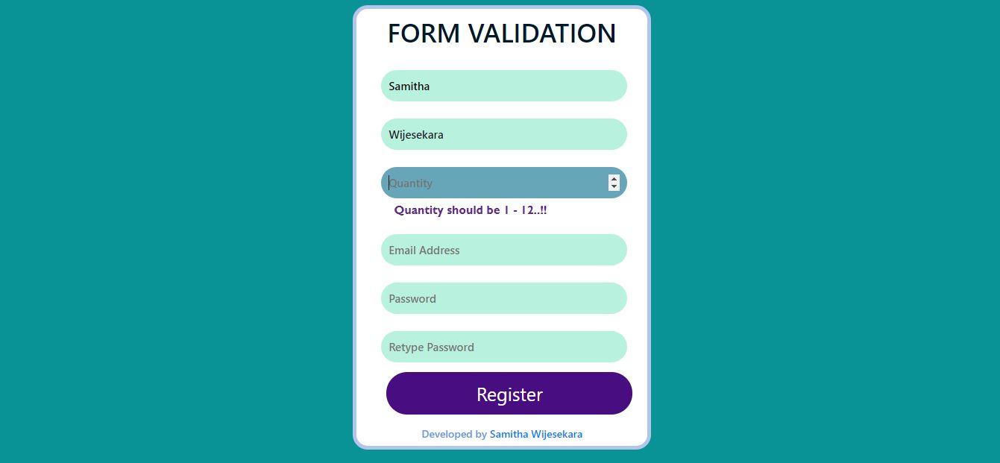
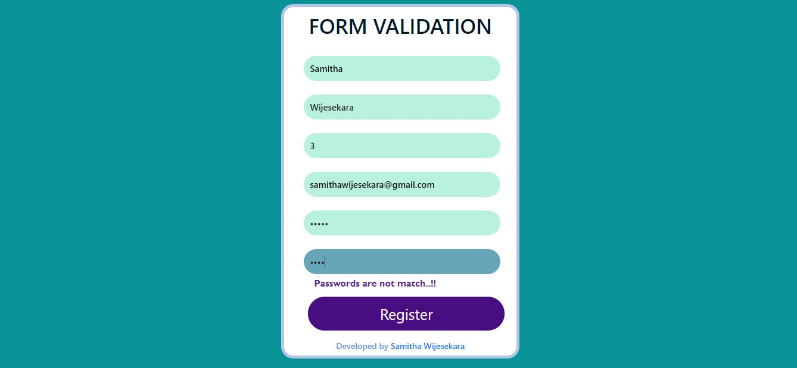

# Form-Validation-with-Javascript
HTML form validation with using Javascript 

💻😍 Online Demo : https://form-validation-with-javascript.netlify.app/

### Table of Content
-01 [Overview](#overview) 
-02 [Used Technologies](#technologies) 
-03 [How it's work?](#work) 

## 01. Overview <a name="overview"/>

Forms are used in webpages for the user to enter their required details that further send it to the server for processing. The data entered into a form needs to be in the right format and certain fields need to be filled in order to effectively use the submitted form. So that's become we need form validation.  

 

## 02. Used Technologies <a name="technologies"/>

In this project, I used **HTML** to make a basic structure of the form. I have used **CSS** to style web form. **JavaScript** was used to validate data that is input by the user. 

## 03. How it's work? <a name="work"/>

The user should have to fill all fields. In the Quantity section, the user should fill numbers between 0 to 13. (That means 1 to 12 only.) Also, two of the password fields should be matched together. Otherwise, the user can't submit the form.

 

  

If user fill all of theese fields correctly user will display "REGISTER SUCCESSFULLY" screen.

